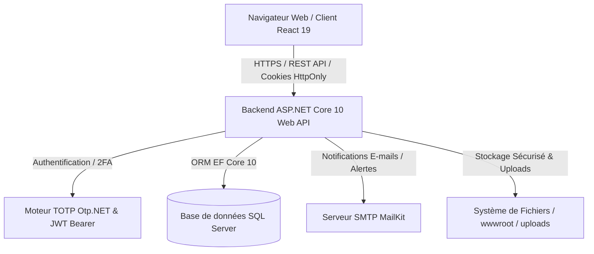

# 📬 CSPJ Mini-Mail

<div align="center">


<br/>

**Plateforme de Messagerie Sécurisée & Gestion Institutionnelle**  
*Solution complète de communication interne, d'échanges inter-associations/fonctionnaires et de support administratif, conçue avec **ASP.NET Core 10 (Web API)** et **React 19 (Vite + Tailwind CSS)**.*

</div>

---

## 📑 Sommaire

- [À propos du projet](#-à-propos-du-projet)
- [Fonctionnalités Principales](#-fonctionnalités-principales)
- [Architecture Technique](#-architecture-technique)
- [Stack Technologique](#-stack-technologique)
- [Structure du Projet](#-structure-du-projet)
- [Sécurité & Conformité](#-sécurité--conformité)
- [Prérequis](#-prérequis)
- [Installation & Démarrage](#-installation--démarrage)
  - [1. Configuration du Backend](#1-configuration-du-backend-aspnet-core)
  - [2. Configuration du Frontend](#2-configuration-du-frontend-react)
- [Points d'Entrée de l'API (Endpoints)](#-points-dentrée-de-lapi-endpoints)
- [Rôles et Permissions](#-rôles-et-permissions)
- [Modules & Aperçu de l'Interface](#-modules--aperçu-de-linterface)
- [Scripts & Commandes Utiles](#-scripts--commandes-utiles)
- [Licence](#-licence)

---

## 🌟 À propos du projet

**CSPJ Mini-Mail** est une application web moderne conçue pour rationaliser et sécuriser les flux de communication administratifs et institutionnels entre :
- Les **Administrateurs** du système (supervision, gestion des comptes, réinitialisation de sécurité, cartographie institutionnelle, logs d'audit)
- Les **Fonctionnaires** (consultation, rédaction, échanges hiérarchiques et sectoriels)
- Les **Associations** et structures partenaires (partage de documents, suivi des sollicitations avec les fonctionnaires affiliés)

La plateforme garantit la stricte confidentialité des données échangées grâce au contrôle d'accès basé sur les rôles (RBAC), à l'authentification à deux facteurs (2FA TOTP), à l'assainissement systématique des contenus HTML et à une traçabilité intégrale via les journaux d'audit.

---

## ✨ Fonctionnalités Principales

### 🔒 1. Authentification & Sécurité Forte
- **Authentification JWT Hybride :** Utilisation de jetons sécurisés stockés dans des cookies `HttpOnly` (`cspj_auth_token`) avec protection CSRF/XSS.
- **Double Authentification (2FA / TOTP) :** Configuration avec QR Code et codes TOTP compatibles avec *Google Authenticator*, *Microsoft Authenticator*, etc.
- **Réinitialisation de mot de passe sécurisée :** Envoi d'un code OTP par e-mail via SMTP avec jeton de réinitialisation temporaire.
- **Récupération Administrateur :** Réinitialisation administrative du mot de passe ou désactivation du 2FA en cas de perte de l'appareil par un utilisateur.
- **Limitation de débit (Rate Limiting) :** Protection contre les attaques par force brute (politique `totp-ops` de 5 requêtes/min max sur les endpoints sensibles).
- **En-têtes de sécurité renforcés :** CSP, HSTS, `X-Content-Type-Options: nosniff`, `X-Frame-Options: DENY`, `Referrer-Policy`.

### 📨 2. Système de Messagerie & Fils de Discussion
- **Organisation par Dossiers :** Boîte de réception (*Inbox*), Messages envoyés (*Sent*), Messages archivés (*Archive*), Favoris (*Starred*).
- **Gestion des Brouillons Dédiée :** Sauvegarde, modification et suppression RESTful de brouillons (`/api/drafts`).
- **Fils de Discussion (Threading) :** Regroupement intelligent des échanges, réponses imbriquées et suivi des participants.
- **Actions Groupées (Bulk Actions) :** Marquage comme lu, archivage et suppression en masse de conversations.
- **Recherche & Filtres Avancés :** Tiroir de filtrage multicritères (par mot-clé, date, expéditeur, statut de lecture, présence de pièces jointes).
- **Éditeur de Texte Enrichi (WYSIWYG) :** Intégration de *Tiptap* avec assainissement HTML côté serveur (`HtmlSanitizerService`) et côté client (`DOMPurify`).
- **Gestion & Prévisualisation des Pièces Jointes :**
  - Validation stricte des types MIME autorisés (PDF, Word, Excel, PowerPoint, Images, Texte brut).
  - Contrôle de taille maximale (10 Mo par fichier).
  - Stockage sécurisé avec identifiants GUID uniques.
  - **Visionneuse intégrée :** Prévisualisation directe dans le navigateur (PDF, images et documents Word `.docx` via `docx-preview`).

### 👥 3. Groupes Institutionnels & Canaux de Diffusion
- **Messagerie de Groupe :** Création de fils de discussion multi-utilisateurs.
- **Administration des Groupes :** Supervision, retrait de membres, archivage global et transfert de propriété (*Owner transfer*).

### 🛠 4. Administration & Supervision Globale
- **Gestion des comptes :** Création, mise à jour de profil, activation/désactivation et suppression logique (*soft delete*).
- **Cartographie Institutionnelle :** Gestion complète (CRUD) des structures/entreprises et assignation Fonctionnaires ↔ Associations.
- **Supervision des conversations :** Consultation de l'ensemble des flux de messagerie et statistiques globales.
- **Journaux d'Audit (Audit Logs) :** Traçabilité exhaustive des actions administratives avec filtrage par utilisateur et journal d'activité individuel.

### 🎫 5. Système de Support & Billetterie
- **Création de tickets :** Signalement d'incidents avec catégories (technique, accès, demande de service) et priorités.
- **Prise en charge (Claim) :** Attribution d'un ticket à un administrateur spécifique.
- **Fils d'échange d'assistance :** Conversation interactive entre l'utilisateur et l'équipe administrative.
- **Suivi des statuts :** `Ouvert` (*Open*), `En cours` (*In Progress*), `Résolu` (*Resolved*), `Fermé` (*Closed*).

---

## 🏗 Architecture Technique



---

## 🛠 Stack Technologique

### Backend
- **Framework :** [.NET 10 / ASP.NET Core Web API](https://dotnet.microsoft.com/)
- **Accès aux données :** Entity Framework Core 10 (SQL Server Provider, Migrations Code-First)
- **Authentification & Sécurité :**
  - `Microsoft.AspNetCore.Authentication.JwtBearer` (JWT Tokens & Cookies HttpOnly)
  - `BCrypt.Net-Next` (Hachage sécurisé des mots de passe)
  - `Otp.NET` (Algorithme TOTP RFC 6238)
  - `HtmlSanitizerService` (Service sur-mesure de nettoyage HTML & filtrage XSS)
- **Services E-mail :** `MailKit` & `MimeKit`
- **Documentation API :** Swashbuckle Swagger / OpenAPI

### Frontend
- **Framework UI :** [React 19](https://react.dev/) + [Vite 8](https://vitejs.dev/)
- **Routage :** `react-router-dom` v7
- **Styles :** [Tailwind CSS v4](https://tailwindcss.com/) + PostCSS + `@tailwindcss/typography`
- **Composants & Icônes :** `lucide-react`
- **Édition de Texte :** `@tiptap/react`, `@tiptap/starter-kit`, `@tiptap/extension-placeholder`, `@tiptap/extension-underline`, `@tiptap/extension-bullet-list`, `@tiptap/extension-text-align`, `@tiptap/extension-link`
- **Prévisualisation de documents :** `docx-preview` (rendu Word DOCX dans le navigateur)
- **Sécurité & Utilitaires :** `dompurify`, `qrcode.react`, `axios`

---

## 📂 Structure du Projet

```text
cspj-mini-mail/
├── Backend/
│   └── CspjMail.Api/
│       ├── Configuration/        # Options typées (SmtpSettings, etc.)
│       ├── Controllers/          # Contrôleurs API REST
│       │   ├── AdminController.cs      # Supervision, utilisateurs, groupes, institutions, logs
│       │   ├── AuthController.cs       # Authentification, 2FA, OTP, profil
│       │   ├── DraftsController.cs     # CRUD complet des brouillons
│       │   ├── MessagesController.cs   # Messagerie, fils, pièces jointes, contacts
│       │   └── SupportController.cs    # Tickets d'assistance, réponses, claim
│       ├── DTOs/                 # Objets de transfert de données
│       ├── Migrations/           # Migrations Entity Framework Core
│       ├── Models/               # Entités EF Core (Utilisateur, Thread, Message, Draft, etc.)
│       ├── Services/             # Logique métier (MailKitEmailService, HtmlSanitizerService)
│       ├── wwwroot/uploads/      # Répertoire de stockage sécurisé des pièces jointes
│       ├── Program.cs            # Pipeline middleware, DI et configuration de sécurité
│       └── appsettings.json      # Configuration de l'application
│
├── Frontend/
│   ├── public/                   # Fichiers statiques publics
│   ├── src/
│   │   ├── assets/               # Images, logos, ressources graphiques
│   │   ├── components/           # Composants réutilisables & Vues modulaires
│   │   │   ├── AttachmentPreviewModal.jsx  # Visionneuse de fichiers (PDF, DOCX, images)
│   │   │   ├── CreateInstitutionModal.jsx  # Modale de création d'institution
│   │   │   ├── DraftsView.jsx              # Liste et reprise des brouillons
│   │   │   ├── Layout.jsx                  # Layout global de navigation
│   │   │   ├── MailList.jsx                # Liste et lecture des fils de discussion
│   │   │   ├── ManageGroups.jsx            # Administration des groupes
│   │   │   ├── ManageInstitutions.jsx      # Administration des institutions
│   │   │   ├── ManageLogs.jsx              # Consultation et filtrage des logs d'audit
│   │   │   ├── ManageSupport.jsx           # Gestion et traitement des tickets de support
│   │   │   ├── ManageUsers.jsx             # Gestion des utilisateurs et assignations
│   │   │   ├── ProfileModal.jsx            # Modale d'aperçu de profil
│   │   │   ├── SearchFilterDrawer.jsx      # Tiroir de recherche multicritères
│   │   │   ├── Sidebar.jsx                 # Barre latérale de navigation
│   │   │   └── TiptapEditor.jsx            # Éditeur riche WYSIWYG
│   │   ├── context/              # Contextes React (AuthContext, MailContext, LogContext)
│   │   ├── pages/                # Pages principales
│   │   │   ├── AdminDashboardPage.jsx
│   │   │   ├── ComposePage.jsx
│   │   │   ├── CreateUserPage.jsx
│   │   │   ├── Dashboard.jsx
│   │   │   ├── ForgotPassword.jsx
│   │   │   ├── Groups.jsx
│   │   │   ├── Login.jsx
│   │   │   ├── ProfilePage.jsx
│   │   │   ├── ResetPassword.jsx
│   │   │   └── SupportPage.jsx
│   │   ├── services/             # Clients API Axios (api.js, draftsApi.js, emailService.js)
│   │   ├── App.jsx               # Routage centralisé de l'application
│   │   ├── main.jsx              # Montage React
│   │   └── index.css             # Import Tailwind CSS et styles globaux
│   ├── package.json              # Dépendances et scripts npm
│   └── vite.config.js            # Configuration du serveur Vite
│
├── run-backend.ps1               # Script PowerShell de démarrage automatique du backend
└── README.md                     # Documentation générale du projet
```

---

## 🛡 Sécurité & Conformité

| Domaine | Implémentation |
| :--- | :--- |
| **Hachage des Mots de Passe** | BCrypt avec salage dynamique |
| **Authentification à Deux Facteurs** | TOTP 6 chiffres standardisé (RFC 6238) via `Otp.NET` |
| **Protection contre les Injections XSS** | Double assainissement HTML (`HtmlSanitizerService` serveur + `DOMPurify` client) |
| **Protection Brute-Force** | Rate Limiting ASP.NET Core sur les routes sensibles (5 req/min) |
| **Sécurité des Pièces Jointes** | Whitelist stricte de types MIME, renommage GUID, limite 10 Mo |
| **Isolation des Rôles (RBAC)** | Politiques strictes avec `[Authorize(Roles = "...")]` |
| **Audit & Traçabilité** | Journalisation des actions critiques avec horodatage, action et utilisateur |

---

## ⚙️ Prérequis

Avant de lancer le projet, assurez-vous d'avoir installé sur votre machine :
- [.NET SDK 10.0](https://dotnet.microsoft.com/download)
- [Node.js](https://nodejs.org/) (version 20+ recommandée) & `npm`
- [Microsoft SQL Server](https://www.microsoft.com/sql-server/) (LocalDB, Express ou Edition Standard)
- Un serveur SMTP valide (ex. compte Google App Password, Mailtrap, etc.)

---

## 🚀 Installation & Démarrage

### 1. Configuration du Backend (ASP.NET Core)

1. Naviguez dans le dossier du projet API :
   ```bash
   cd Backend/CspjMail.Api
   ```

2. Configurez vos paramètres locaux (dans `appsettings.Development.json` ou via `dotnet user-secrets`) :
   ```json
   {
     "ConnectionStrings": {
       "DefaultConnection": "Server=(localdb)\\mssqllocaldb;Database=CspjMiniMailDb;Trusted_Connection=True;MultipleActiveResultSets=true"
     },
     "Jwt": {
       "Key": "VOTRE_CLE_SECRETE_D_AU_MOINS_32_CARACTERES_TRES_LONGUE_ET_SECURISEE",
       "Issuer": "CspjMailApi",
       "Audience": "CspjMailFrontend",
       "DurationInMinutes": 180
     },
     "SmtpSettings": {
       "Server": "smtp.gmail.com",
       "Port": 587,
       "SenderName": "CSPJ Mail Security",
       "SenderEmail": "votre-email@gmail.com",
       "Username": "votre-email@gmail.com",
       "Password": "votre-mot-de-passe-d-application"
     }
   }
   ```

3. Appliquez les migrations de la base de données :
   ```bash
   dotnet ef database update
   ```

4. Lancez le serveur backend :
   ```bash
   dotnet run
   ```
   *L'API démarre par défaut sur `http://localhost:5182` (Swagger est accessible sur `http://localhost:5182/swagger` en mode Développement).*

---

### 2. Configuration du Frontend (React)

1. Naviguez dans le dossier `Frontend` :
   ```bash
   cd Frontend
   ```

2. Installez les dépendances npm :
   ```bash
   npm install --legacy-peer-deps
   ```

3. Vérifiez le fichier `.env` :
   ```env
   VITE_API_BASE_URL=http://localhost:5182/api
   ```

4. Démarrez le serveur de développement Vite :
   ```bash
   npm run dev
   ```
   *L'application sera accessible sur `http://localhost:5173`.*

---

## 📡 Points d'Entrée de l'API (Endpoints)

### 🔑 Authentification & Compte (`/api/auth`)
- `POST /api/auth/login` : Connexion initiale (vérification e-mail / mot de passe + vérification/initiation 2FA).
- `POST /api/auth/verify-2fa` : Validation du code TOTP et émission du jeton d'accès JWT dans un cookie sécurisé.
- `POST /api/auth/logout` : Révocation du cookie de session.
- `GET /api/auth/me` : Récupération des informations de l'utilisateur connecté.
- `PUT /api/auth/profile` : Mise à jour du profil (nom, prénom, téléphone, statut 2FA).
- `POST /api/auth/change-password` : Modification du mot de passe utilisateur.
- `POST /api/auth/forgot-password` : Demande d'envoi d'un code OTP par e-mail.
- `POST /api/auth/verify-otp` : Validation du code OTP reçu par e-mail.
- `POST /api/auth/reset-password-otp` : Définition d'un nouveau mot de passe avec le jeton OTP.

### ✉️ Messagerie & Fils de Discussion (`/api/messages`)
- `GET /api/messages/inbox` : Récupération des messages reçus.
- `GET /api/messages/sent` : Récupération des messages envoyés.
- `GET /api/messages/archive` : Récupération des messages archivés.
- `GET /api/messages/unread-count` : Nombre total de messages non lus.
- `GET /api/messages/thread/{threadId}` : Détails complets d'un fil de discussion et de ses messages.
- `POST /api/messages/thread` : Création et envoi d'un nouveau fil/message avec pièces jointes (`multipart/form-data`).
- `POST /api/messages/thread/{threadId}/reply` : Réponse à un fil de discussion existant.
- `PUT /api/messages/thread/{threadId}/star` : Marquer / Démarquer un fil comme favori.
- `PUT /api/messages/thread/{threadId}/archive` : Archiver / Désarchiver un fil de discussion.
- `DELETE /api/messages/thread/{threadId}` : Suppression d'un fil pour l'utilisateur.
- `GET /api/messages/search` : Recherche avancée multicritères (mots-clés, expéditeur, dates, statut).
- `GET /api/messages/contacts` : Liste des contacts directs pour l'autocomplétion.
- `GET /api/messages/assignable` : Liste des utilisateurs éligibles pour l'envoi de messages.
- `GET /api/messages/institutions` : Liste des institutions autorisées.
- `GET /api/messages/direct` : Conversations directes entre utilisateurs.
- `GET /api/messages/groups` : Liste des groupes auxquels l'utilisateur participe.
- `POST /api/messages/groups/create` : Création d'une nouvelle discussion de groupe.
- `GET /api/messages/attachments/download/{id}` : Téléchargement sécurisé d'une pièce jointe.
- `POST /api/messages/bulk-read` : Marquage groupé de plusieurs fils comme lus.
- `POST /api/messages/bulk-archive` : Archivage groupé de plusieurs fils.
- `POST /api/messages/bulk-delete` : Suppression groupée de plusieurs fils.

### 📝 Brouillons (`/api/drafts`)
- `GET /api/drafts` : Récupération de tous les brouillons de l'utilisateur.
- `GET /api/drafts/{id}` : Récupération d'un brouillon spécifique par son identifiant.
- `POST /api/drafts` : Création et sauvegarde d'un nouveau brouillon.
- `PUT /api/drafts/{id}` : Mise à jour d'un brouillon existant.
- `DELETE /api/drafts/{id}` : Suppression définitive d'un brouillon.

### 🛠 Administration (`/api/admin`) *(Rôle: Administrateur)*
- `GET /api/admin/stats` : Statistiques globales du tableau de bord (utilisateurs, messages, tickets, etc.).
- `GET /api/admin/users` : Liste complète des utilisateurs enregistrés.
- `POST /api/admin/users` : Création d'un nouveau compte utilisateur.
- `PUT /api/admin/users/{id}` : Mise à jour des informations d'un utilisateur.
- `PUT /api/admin/users/{id}/status` : Activation ou désactivation d'un compte.
- `DELETE /api/admin/users/{id}` : Suppression logique (*soft delete*) d'un compte.
- `POST /api/admin/users/{id}/reset-password` : Réinitialisation administrative du mot de passe utilisateur.
- `POST /api/admin/users/{userId}/reset-2fa` : Réinitialisation/désactivation du 2FA pour un utilisateur ayant perdu son accès.
- `GET /api/admin/users/{id}/assignments` : Liste des fonctionnaires assignés à une association.
- `PUT /api/admin/users/{id}/assignments` : Mise à jour des assignations Fonctionnaires ↔ Association.
- `GET /api/admin/users/{id}/groups` : Groupes auxquels appartient un utilisateur spécifique.
- `GET /api/admin/institutions` : Liste des institutions et entreprises.
- `POST /api/admin/institutions` : Création d'une nouvelle structure institutionnelle.
- `PUT /api/admin/institutions/{id}` : Mise à jour d'une institution.
- `DELETE /api/admin/institutions/{id}` : Suppression d'une institution.
- `GET /api/admin/threads` : Vue globale et supervision de tous les fils de discussion.
- `GET /api/admin/groups` : Liste de tous les groupes créés sur la plateforme.
- `DELETE /api/admin/groups/{id}` : Archivage global d'un groupe pour l'ensemble des membres.
- `DELETE /api/admin/groups/{id}/members/{userId}` : Retrait forcé d'un membre d'un groupe.
- `PUT /api/admin/groups/{id}/transfer-owner` : Transfert de la propriété d'un groupe à un autre membre.
- `GET /api/admin/audit-logs` : Consultation des journaux d'audit de sécurité (avec filtre optionnel par `userId`).
- `GET /api/admin/users/{userId}/activity` : Journal d'activité strictement ciblé sur un utilisateur.
- `POST /api/admin/audit-logs` : Ajout manuel d'une entrée dans le journal d'audit.

### 🎫 Support & Assistance (`/api/support`)
- `GET /api/support/tickets` : Liste des tickets de l'utilisateur (ou ensemble des tickets pour les administrateurs).
- `POST /api/support/tickets` : Création d'un nouveau ticket d'assistance.
- `GET /api/support/tickets/{id}` : Détails d'un ticket et fil complet des échanges.
- `POST /api/support/tickets/{id}/messages` : Envoi d'une réponse dans le fil d'un ticket.
- `PUT /api/support/tickets/{id}/status` : Modification du statut du ticket (`Open`, `In Progress`, `Resolved`, `Closed`).
- `PUT /api/support/tickets/{id}/claim` : Prise en charge d'un ticket par un administrateur.

---

## 👥 Rôles et Permissions

| Rôle | Périmètre d'Accès |
| :--- | :--- |
| **Administrateur** | Accès complet : gestion des comptes, réinitialisation de sécurité (MDP/2FA), configuration des institutions, assignations Fonctionnaires-Associations, gestion des groupes, consultation des logs d'audit, traitement et prise en charge des tickets de support, supervision des flux de messagerie. |
| **Fonctionnaire** | Messagerie sécurisée, gestion des dossiers personnels et brouillons, communication avec sa hiérarchie et ses associations de rattachement, participation aux groupes, ouverture et suivi de tickets de support. |
| **Association** | Échanges avec les fonctionnaires affiliés et l'administration, participation aux groupes dédiés, gestion des pièces jointes, support. |

---

## 🖥 Modules & Aperçu de l'Interface

| Module | Description |
| :--- | :--- |
| **Boîte de Réception & Fils** | Consultation chronologique des conversations, filtrage par état, gestion des favoris, actions groupées et lecture fluide des fils. |
| **Rédaction (Compose) & Brouillons** | Éditeur riche Tiptap, mise en forme avancée, insertion de pièces jointes, panneau multi-destinataires et sauvegarde automatique/manuelle des brouillons. |
| **Visionneuse de Documents** | Modal de prévisualisation directe des documents PDF, images et fichiers Word `.docx` sans téléchargement obligatoire. |
| **Groupes & Diffusion** | Messagerie collective ciblée par structure associative ou groupe de travail institutionnel avec panneau d'administration dédié. |
| **Tableau de Bord Administrateur** | Supervision centralisée, métriques clés, gestion des utilisateurs, activation de comptes, mapping Fonctionnaires-Associations et institutions. |
| **Espace Support & Tickets** | Soumission et suivi des tickets d'assistance avec messagerie intégrée et système de prise en charge (*Claim*) par les administrateurs. |
| **Sécurité & Profil** | Gestion du profil utilisateur, modification de mot de passe et configuration/activation du 2FA TOTP avec QR Code. |

---

## 💻 Scripts & Commandes Utiles

### Frontend
```bash
npm run dev      # Démarrer le serveur de développement Vite (http://localhost:5173)
npm run build    # Compiler le bundle de production dans dist/
npm run preview  # Prévisualiser la version de production localement
npm run lint     # Analyser le code avec ESLint
```

### Backend
```bash
# Démarrage direct depuis la racine du projet via PowerShell :
.\run-backend.ps1

# Ou depuis le dossier Backend/CspjMail.Api :
dotnet run                         # Lancer l'API en mode développement
dotnet build                       # Compiler la solution backend
dotnet ef migrations add <Nom>     # Créer une nouvelle migration EF Core
dotnet ef database update          # Appliquer les migrations à la base SQL Server
```

---

## 📄 Licence

Ce projet est développé dans le cadre des systèmes d'information institutionnels internes. Tous droits réservés.