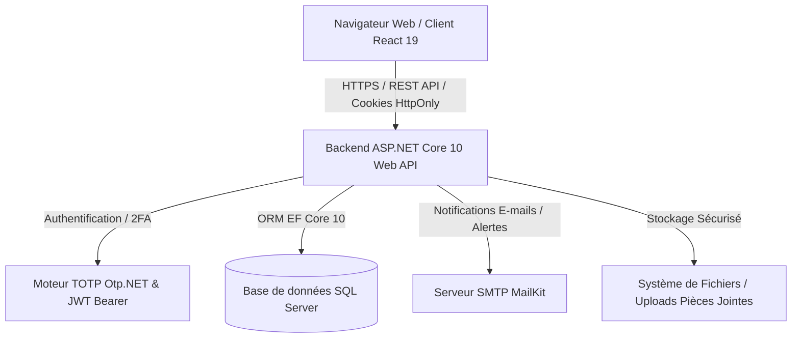

# 📬 CSPJ Mini-Mail

<div align="center">


<br/>

**Plateforme de Messagerie Sécurisée & Gestion Institutionnelle**  
*Solution complète de communication interne, d'échanges inter-associations/fonctionnaires et de support administratif, conçue avec **ASP.NET Core 10 (Web API)** et **React 19 (Vite + Tailwind CSS)**.*

</div>

---

## 📑 Sommaire

- [À propos du projet](#-à-propos-du-projet)
- [Fonctionnalités Principales](#-fonctionnalités-principales)
- [Architecture Technique](#-architecture-technique)
- [Stack Technologique](#-stack-technologique)
- [Structure du Projet](#-structure-du-projet)
- [Sécurité & Conformité](#-sécurité--conformité)
- [Prérequis](#-prérequis)
- [Installation & Démarrage](#-installation--démarrage)
  - [1. Configuration du Backend](#1-configuration-du-backend-aspnet-core)
  - [2. Configuration du Frontend](#2-configuration-du-frontend-react)
- [Points d'Entrée de l'API (Endpoints)](#-points-dentrée-de-lapi-endpoints)
- [Rôles et Permissions](#-rôles-et-permissions)
- [Modules & Aperçu de l'Interface](#-modules--aperçu-de-linterface)
- [Scripts & Commandes Utiles](#-scripts--commandes-utiles)
- [Licence](#-licence)

---

## 🌟 À propos du projet

**CSPJ Mini-Mail** est une application web moderne conçue pour rationaliser et sécuriser les flux de communication administratifs et institutionnels entre :
- Les **Administrateurs** du système (supervision, gestion des comptes, paramétrages, logs d'audit)
- Les **Fonctionnaires** (consultation, rédaction, échanges hiérarchiques et sectoriels)
- Les **Associations** et structures partenaires (partage de documents, suivi des sollicitations)

La plateforme garantit la stricte confidentialité des données échangées grâce au contrôle d'accès basé sur les rôles (RBAC), à l'authentification à deux facteurs (2FA TOTP), à l'assainissement systématique des contenus HTML et à une traçabilité intégrale via les journaux d'audit.

---

## ✨ Fonctionnalités Principales

### 🔒 1. Authentification & Sécurité Forte
- **Authentification JWT Hybride :** Utilisation de jetons sécurisés stockés dans des cookies `HttpOnly` (`cspj_auth_token`) avec protection CSRF/XSS.
- **Double Authentification (2FA / TOTP) :** Génération de secrets Base32 et QR Codes compatibles avec *Google Authenticator*, *Microsoft Authenticator*, etc.
- **Réinitialisation de mot de passe sécurisée :** Envoi d'un code OTP par e-mail via SMTP avec jeton de réinitialisation éphémère.
- **Limitation de débit (Rate Limiting) :** Protection contre les attaques par force brute (politique `totp-ops` de 5 requêtes/min max sur les endpoints sensibles).
- **En-têtes de sécurité renforcés :** CSP, HSTS, `X-Content-Type-Options: nosniff`, `X-Frame-Options: DENY`, `Referrer-Policy`.

### 📨 2. Système de Messagerie Complète
- **Organisation par Dossiers :** Boîte de réception (*Inbox*), Messages envoyés (*Sent*), Brouillons (*Drafts*), Corbeille (*Trash*), Courrier indésirable (*Spam*), et Favoris (*Starred*).
- **Fils de Discussion (Threading) :** Regroupement intelligent des échanges et des réponses par fil de discussion.
- **Éditeur de Texte Enrichi (WYSIWYG) :** Intégration de *Tiptap* avec assainissement HTML côté serveur (*HtmlSanitizer*) et client (*DOMPurify*).
- **Gestion des Pièces Jointes :**
  - Validation stricte des types MIME autorisés (PDF, Word, Excel, PowerPoint, Images, Texte brut).
  - Contrôle de taille maximale (10 Mo par fichier).
  - Stockage sécurisé avec identifiants GUID uniques et en-têtes anti-mise en cache.
- **Messagerie de Groupe & Diffusion :** Envoi ciblé aux associations ou aux fonctionnaires associés.

### 👥 3. Administration & Gestion des Utilisateurs
- **Gestion des comptes :** Création, modification, activation/désactivation, et suppression logique (*soft delete*).
- **Cartographie Institutionnelle :** Affectation des utilisateurs à des entreprises/institutions et liaison des fonctionnaires aux associations.
- **Journaux d'Audit (Audit Logs) :** Traçabilité exhaustive des actions administratives (créations, modifications de rôles, suppressions).
- **Statistiques & Métriques :** Tableaux de bord de supervision de l'activité globale de la plateforme.

### 🎫 4. Système de Support & Billetterie
- **Création de tickets :** Signalement d'incidents avec catégories (technique, accès, demande de service) et priorités.
- **Fils d'échange d'assistance :** Conversation interactive entre l'utilisateur et l'équipe administrative.
- **Suivi des statuts :** `Ouvert` (*Open*), `En cours` (*In Progress*), `Résolu` (*Resolved*), `Fermé` (*Closed*).

---

## 🏗 Architecture Technique



---

## 🛠 Stack Technologique

### Backend
- **Framework :** [.NET 10 / ASP.NET Core Web API](https://dotnet.microsoft.com/)
- **Accès aux données :** Entity Framework Core 10 (SQL Server Provider, Migrations Code-First)
- **Authentification & Sécurité :**
  - `Microsoft.AspNetCore.Authentication.JwtBearer` (JWT Tokens)
  - `BCrypt.Net-Next` (Hachage sécurisé des mots de passe)
  - `Otp.NET` (Algorithme TOTP RFC 6238)
  - `Ganss.Xss.HtmlSanitizer` (Nettoyage des contenus HTML)
- **Services E-mail :** `MailKit` & `MimeKit`
- **Documentation API :** Swashbuckle Swagger / OpenAPI

### Frontend
- **Framework UI :** [React 19](https://react.dev/) + [Vite 8](https://vitejs.dev/)
- **Routage :** `react-router-dom` v7
- **Styles :** [Tailwind CSS v4](https://tailwindcss.com/) + PostCSS + `@tailwindcss/typography`
- **Composants & Icônes :** `lucide-react`
- **Édition de Texte :** `@tiptap/react`, `@tiptap/starter-kit`, `@tiptap/extension-placeholder`, `@tiptap/extension-underline`, `@tiptap/extension-bullet-list`, `@tiptap/extension-text-align`
- **Sécurité & Utilitaires :** `dompurify`, `qrcode.react`, `axios`

---

## 📂 Structure du Projet

```text
cspj-mini-mail/
├── Backend/
│   └── CspjMail.Api/
│       ├── Configuration/        # Options et configuration typée (SmtpSettings, etc.)
│       ├── Controllers/          # Contrôleurs API REST
│       │   ├── AdminController.cs
│       │   ├── AuthController.cs
│       │   ├── MessagesController.cs
│       │   └── SupportController.cs
│       ├── DTOs/                 # Objets de transfert de données (Requêtes / Réponses)
│       ├── Migrations/           # Migrations Entity Framework Core
│       ├── Models/               # Entités de la base de données (Utilisateur, Message, etc.)
│       ├── Services/             # Logique métier & services (MailKitEmailService, etc.)
│       ├── wwwroot/uploads/      # Répertoire de stockage des pièces jointes
│       ├── Program.cs            # Point d'entrée, pipeline middleware et injection de dépendances
│       └── appsettings.json      # Configuration de l'application
│
├── Frontend/
│   ├── public/                   # Fichiers statiques publics
│   ├── src/
│   │   ├── assets/               # Images, logos, ressources graphiques
│   │   ├── components/           # Composants réutilisables (Navbar, Sidebar, Modals, etc.)
│   │   ├── context/              # Contextes React (AuthContext, etc.)
│   │   ├── pages/                # Vues & Pages principales
│   │   │   ├── AdminDashboardPage.jsx
│   │   │   ├── ComposePage.jsx
│   │   │   ├── CreateUserPage.jsx
│   │   │   ├── Dashboard.jsx
│   │   │   ├── ForgotPassword.jsx
│   │   │   ├── Groups.jsx
│   │   │   ├── Login.jsx
│   │   │   ├── ProfilePage.jsx
│   │   │   ├── ResetPassword.jsx
│   │   │   └── SupportPage.jsx
│   │   ├── services/             # Services d'appel API Axios
│   │   ├── App.jsx               # Configuration des routes
│   │   ├── main.jsx              # Montage de l'application React
│   │   └── index.css             # Import Tailwind et styles globaux
│   ├── package.json              # Dépendances et scripts npm
│   └── vite.config.js            # Configuration du serveur Vite
│
└── README.md                     # Documentation générale du projet
```

---

## 🛡 Sécurité & Conformité

| Domaine | Implémentation |
| :--- | :--- |
| **Hachage des Mots de Passe** | BCrypt avec salage dynamique |
| **Authentification à Deux Facteurs** | TOTP 6 chiffres standardisé (RFC 6238) |
| **Protection contre les Injections XSS** | Double assainissement HTML (`HtmlSanitizer` + `DOMPurify`) |
| **Protection Brute-Force** | Rate Limiting ASP.NET Core sur les routes sensibles (5 req/min) |
| **Sécurité des Pièces Jointes** | Whitelist stricte de types MIME, renommage GUID, limite 10 Mo |
| **Isolation des Rôles (RBAC)** | Politiques strictes avec `[Authorize(Roles = "...")]` |
| **Audit & Traçabilité** | Journalisation des actions critiques avec horodatage et IP |

---

## ⚙️ Prérequis

Avant de lancer le projet, assurez-vous d'avoir installé sur votre machine :
- [.NET SDK 10.0](https://dotnet.microsoft.com/download)
- [Node.js](https://nodejs.org/) (version 20+ recommandée) & `npm`
- [Microsoft SQL Server](https://www.microsoft.com/sql-server/) (LocalDB, Express ou Edition Standard)
- Un serveur SMTP valide (ex. compte Google App Password, Mailtrap, etc.)

---

## 🚀 Installation & Démarrage

### 1. Configuration du Backend (ASP.NET Core)

1. Naviguez dans le dossier du projet API :
   ```bash
   cd Backend/CspjMail.Api
   ```

2. Configurez vos paramètres locaux (dans `appsettings.Development.json` ou via `dotnet user-secrets`) :
   ```json
   {
     "ConnectionStrings": {
       "DefaultConnection": "Server=(localdb)\\mssqllocaldb;Database=CspjMiniMailDb;Trusted_Connection=True;MultipleActiveResultSets=true"
     },
     "Jwt": {
       "Key": "VOTRE_CLE_SECRETE_D_AU_MOINS_32_CARACTERES_TRES_LONGUE_ET_SECURISEE",
       "Issuer": "CspjMailApi",
       "Audience": "CspjMailFrontend",
       "DurationInMinutes": 180
     },
     "SmtpSettings": {
       "Server": "smtp.gmail.com",
       "Port": 587,
       "SenderName": "CSPJ Mail Security",
       "SenderEmail": "votre-email@gmail.com",
       "Username": "votre-email@gmail.com",
       "Password": "votre-mot-de-passe-d-application"
     }
   }
   ```

3. Appliquez les migrations de la base de données :
   ```bash
   dotnet ef database update
   ```

4. Lancez le serveur backend :
   ```bash
   dotnet run
   ```
   *L'API démarre par défaut sur `http://localhost:5182` (et Swagger est accessible sur `http://localhost:5182/swagger` en mode Développement).*

---

### 2. Configuration du Frontend (React)

1. Naviguez dans le dossier `Frontend` :
   ```bash
   cd ../../Frontend
   ```

2. Installez les dépendances npm :
   ```bash
   npm install --legacy-peer-deps
   ```

3. Vérifiez le fichier `.env` :
   ```env
   VITE_API_BASE_URL=http://localhost:5182/api
   ```

4. Démarrez le serveur de développement Vite :
   ```bash
   npm run dev
   ```
   *L'application sera accessible sur `http://localhost:5173`.*

---

## 📡 Points d'Entrée de l'API (Endpoints)

### 🔑 Authentification (`/api/auth`)
- `POST /api/auth/login` : Connexion initiale (vérification e-mail / mot de passe + vérification/génération 2FA).
- `POST /api/auth/verify-2fa` : Validation du code TOTP et émission du jeton d'accès JWT.
- `POST /api/auth/forgot-password` : Demande de réinitialisation de mot de passe par code e-mail.
- `POST /api/auth/verify-reset-code` : Validation du code reçu par e-mail.
- `POST /api/auth/reset-password` : Définition d'un nouveau mot de passe.
- `POST /api/auth/logout` : Révocation du cookie de session.

### ✉️ Messagerie (`/api/messages`)
- `GET /api/messages/inbox` : Récupération des messages reçus.
- `GET /api/messages/sent` : Récupération des messages envoyés.
- `GET /api/messages/drafts` : Récupération des brouillons.
- `GET /api/messages/trash` : Messages supprimés (corbeille).
- `GET /api/messages/spam` : Messages marqués comme spam.
- `GET /api/messages/thread/{threadId}` : Détails complets d'un fil de discussion.
- `POST /api/messages/send` : Envoi d'un message avec pièces jointes (Multipart/form-data).
- `POST /api/messages/save-draft` : Sauvegarde ou mise à jour d'un brouillon.
- `PATCH /api/messages/{id}/star` : Marquer / Démarquer comme favori.
- `PATCH /api/messages/{id}/trash` : Déplacer vers la corbeille.
- `DELETE /api/messages/{id}/permanent` : Suppression définitive.

### 🛠 Administration (`/api/admin`) *(Rôle: Administrateur)*
- `GET /api/admin/users` : Liste de tous les utilisateurs du système.
- `POST /api/admin/users` : Création d'un nouvel utilisateur.
- `PUT /api/admin/users/{id}` : Mise à jour des informations d'un compte.
- `PATCH /api/admin/users/{id}/toggle-status` : Activation / Désactivation d'un compte.
- `DELETE /api/admin/users/{id}` : Suppression logique d'un utilisateur.
- `GET /api/admin/audit-logs` : Consultation des journaux d'audit de sécurité.
- `GET /api/admin/institutions` : Gestion des institutions et structures associatives.

### 🎫 Support & Assistance (`/api/support`)
- `GET /api/support/tickets` : Liste des tickets de l'utilisateur (ou tous pour les administrateurs).
- `POST /api/support/tickets` : Création d'un nouveau ticket d'assistance.
- `GET /api/support/tickets/{id}` : Consultation détaillée d'un ticket et de ses messages.
- `POST /api/support/tickets/{id}/reply` : Réponse à un ticket existant.
- `PATCH /api/support/tickets/{id}/status` : Modification de l'état du ticket.

---

## 👥 Rôles et Permissions

| Rôle | Périmètre d'Accès |
| :--- | :--- |
| **Administrateur** | Accès complet : gestion des comptes, configuration des institutions, consultation des logs d'audit, traitement des tickets de support, messagerie globale. |
| **Fonctionnaire** | Messagerie sécurisée, gestion des dossiers personnels, communication avec sa hiérarchie et ses associations de rattachement, ouverture de tickets de support. |
| **Association** | Échanges avec les fonctionnaires affiliés et l'administration, consultation des informations partagées, support. |

---

## 🖥 Modules & Aperçu de l'Interface

| Module | Description |
| :--- | :--- |
| **Boîte de Réception & Fils** | Consultation chronologique des conversations, filtrage par état, gestion des favoris et pièces jointes. |
| **Rédaction (Compose)** | Éditeur riche Tiptap avec support RTL, mise en forme avancée, insertion de pièces jointes et panneau multi-destinataires. |
| **Groupes & Diffusion** | Messagerie collective ciblée par structure associative ou groupe de travail institutionnel. |
| **Tableau de Bord Administrateur** | Gestion centralisée des utilisateurs, activation de comptes, mapping d'institutions et suivi des journaux d'audit. |
| **Espace Support & Tickets** | Soumission et suivi des tickets d'assistance avec messagerie intégrée entre utilisateurs et administrateurs. |

---

## 💻 Scripts & Commandes Utiles

### Frontend
```bash
npm run dev      # Démarrer le serveur de développement Vite (http://localhost:5173)
npm run build    # Compiler le bundle de production dans dist/
npm run preview  # Prévisualiser la version de production localement
npm run lint     # Analyser le code avec ESLint
```

### Backend
```bash
# Démarrage direct depuis la racine du projet :
cd backend/CspjMail.Api && dotnet run

# Ou depuis le dossier Backend/CspjMail.Api :
dotnet run                         # Lancer l'API en mode développement
dotnet build                       # Compiler la solution backend
dotnet ef migrations add <Nom>     # Créer une nouvelle migration EF Core
dotnet ef database update          # Appliquer les migrations à la base SQL Server
```

---

## 📄 Licence

Ce projet est développé dans le cadre des systèmes d'information institutionnels internes. Tous droits réservés.